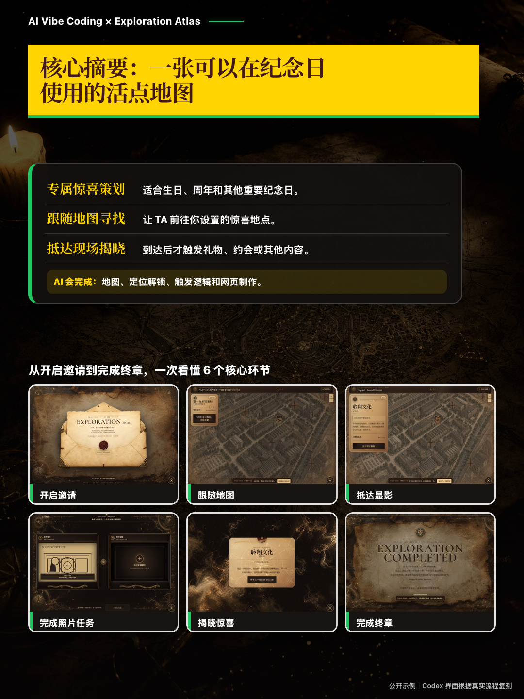
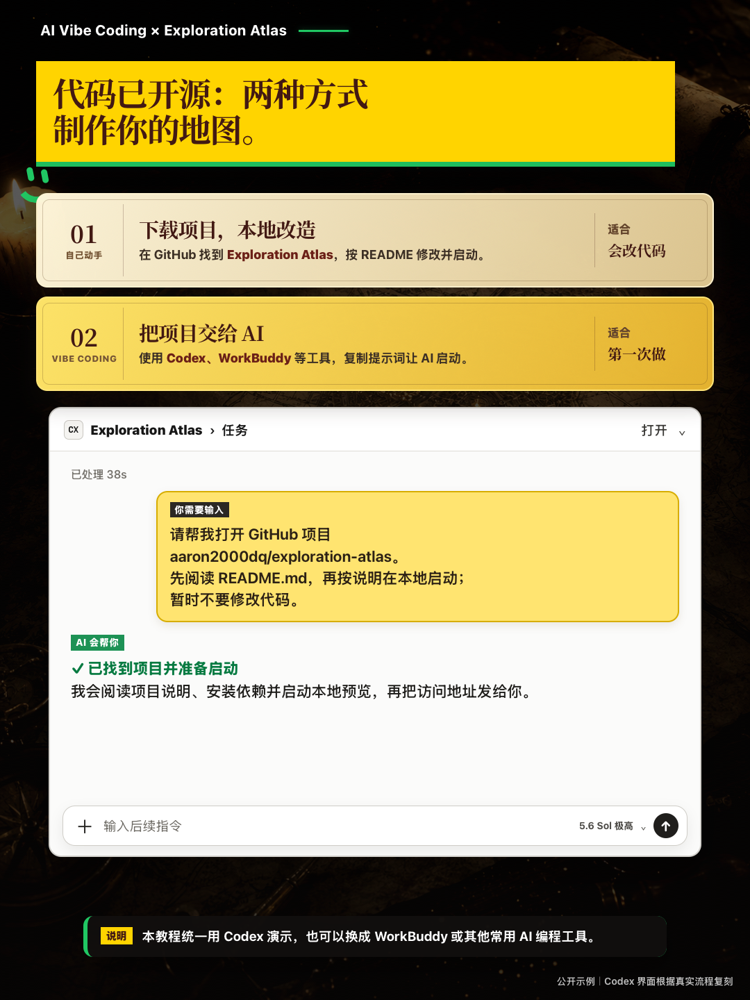
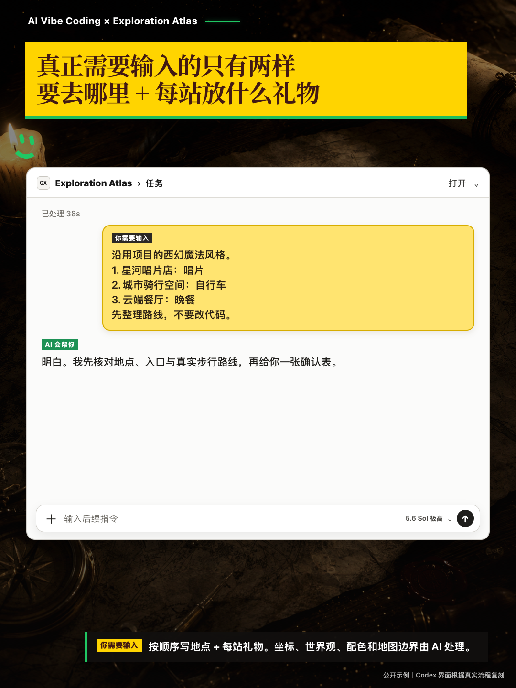
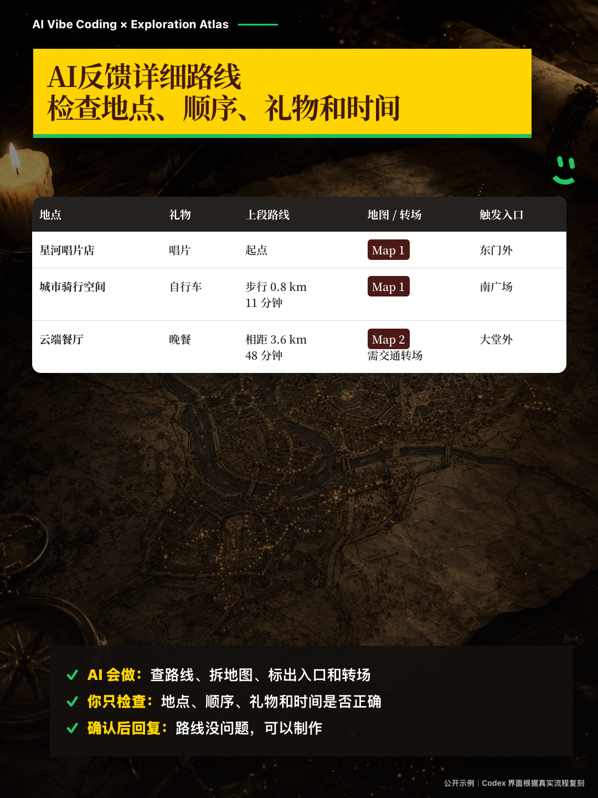
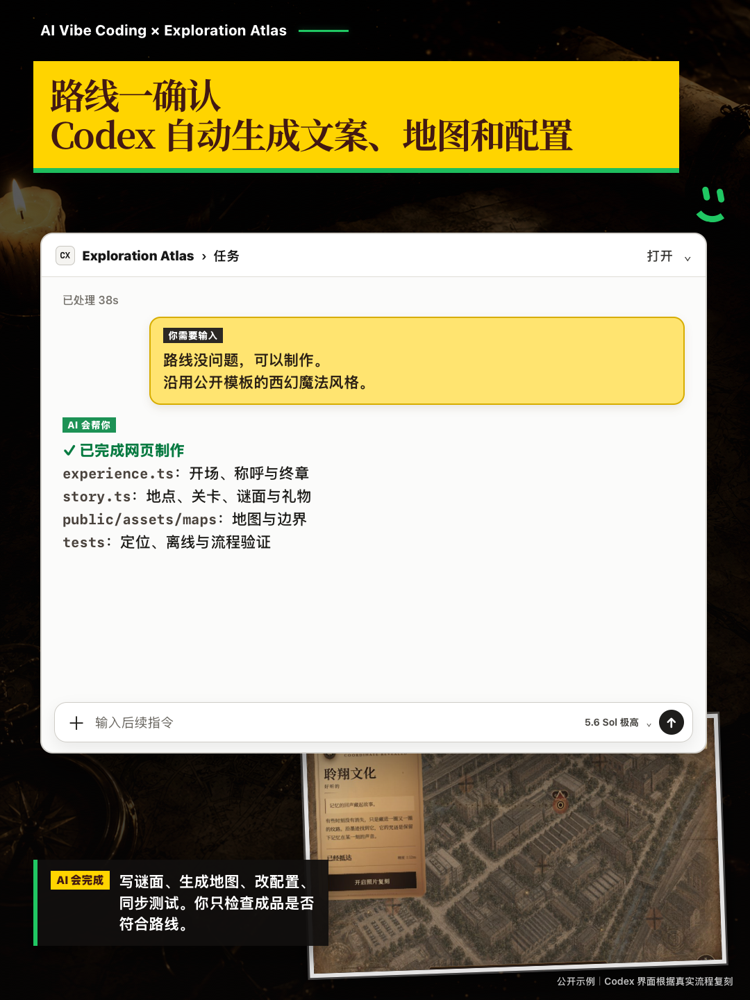
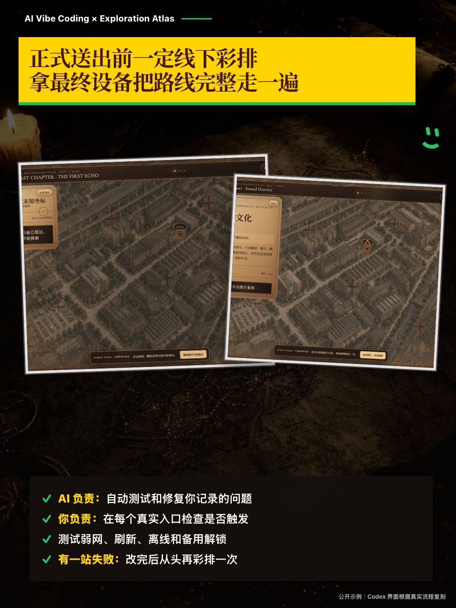
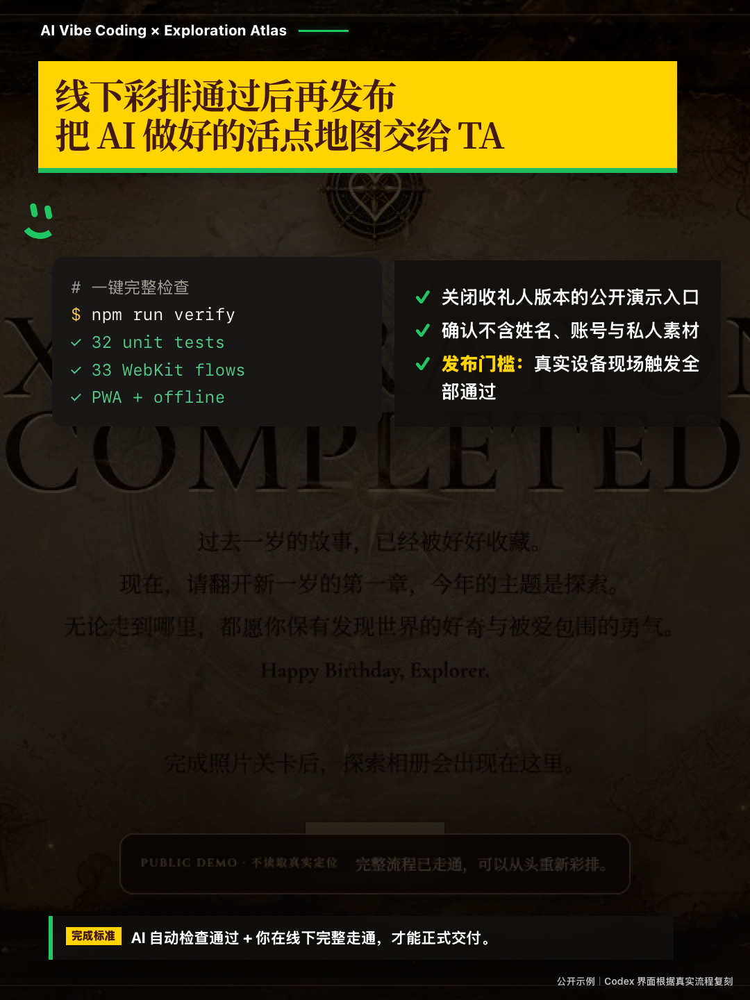

# AI Vibe Coding × Exploration Atlas 图示教程

这是一套面向非技术用户的 13 张图教程，包含 12 个操作页面和 1 张完成页。你只需要准备按顺序要去的地点，以及每一站要揭晓的礼物或体验；Codex 会继续完成地点核验、坐标转换、真实步行路线查询、地图分组、文案、配置与测试。


## 开始前只准备两样东西

```text
1. [地点名称、地址或地图链接]：[礼物或体验]
2. [地点名称、地址或地图链接]：[礼物或体验]
3. [地点名称、地址或地图链接]：[礼物或体验]
```

不需要手填坐标、世界观、配色、字体或技术配置。完整的 AI 交互规则见 [从零定制指南](CUSTOMIZE_WITH_AI.md)。

## 01｜先认识这张活点地图


## 02｜核心摘要



这是一张可以在纪念日使用的活点地图。它适合生日、周年和其他重要日子：TA 从开启邀请开始，跟随地图寻找你设置的地点，抵达后触发照片任务与惊喜揭晓，最后完成整场探索。你决定地点与惊喜，AI 负责地图、定位解锁、触发逻辑和网页制作。

## 03｜代码已开源：两种方式制作你的地图



有动手改造能力，可以在 GitHub 找到 Exploration Atlas，下载到本地，按 README 修改并启动。

想借助 Vibe Coding，可以使用 Codex、WorkBuddy 等 AI 编程工具，把下面这句话复制给它：

```text
请帮我打开 GitHub 项目 aaron2000dq/exploration-atlas。
先阅读 README.md，再按说明在本地启动；暂时不要修改代码。
```

AI 会阅读项目说明、安装依赖、启动本地预览，并把访问地址发给你。本教程统一用 Codex 演示，也可以换成其他常用 AI 编程工具。

## 04｜让 Codex 先读项目规则


让 Codex 完整阅读 `README.md`、`AGENTS.md` 和 `docs/CUSTOMIZE_WITH_AI.md`。它会知道坐标、地图分组、隐私和验证都应该由 AI 处理。

## 05｜输入地点和礼物



黄色区域是用户需要提供的内容。地点可以写名称、地址或地图分享链接；不用填写经纬度。

## 06｜输入地址后，和 AI 确认现实策划地点


AI 会处理同名地点消歧、室外触发入口选择，以及 WGS-84 坐标转换。你只确认“是不是这里”。

## 07｜检查真实步行可达性


AI 会查询实际步行路线，检查河流、高架、封闭园区、累计距离与预约时间；过远时自动拆成下一张地图。

## 08｜AI反馈详细路线，检查地点、顺序、礼物和时间



你只需要核对地点、顺序、礼物与时间。坐标数字、地图边界和技术细节由 AI 负责。

## 09｜Codex 自动完成制作



确认路线后，Codex 会生成未抵达谜面、抵达文案、地图、配置和测试，并保留离线、恢复与备用解锁能力。

## 10｜在电脑走完公开演示


可以直接请 Codex 帮你安装依赖并启动项目。公开演示不读取真实定位，适合先检查信封、地图、揭晓、照片任务与终章。

## 11｜用最终设备线下彩排



自动测试不能代替实地检查。正式送出前，要拿当天使用的手机或平板，从真实起点完整走一遍，逐站确认入口、定位、离线缓存和备用解锁。

## 12｜检查通过后再交付



最终标准是：代码检查全部通过，并且真实路线已在最终设备上完整触发。此时再关闭公开演示入口，交付给收件人。

## 13｜教程完成


希望能帮你给在意的Ta提供一次奇妙的「活点地图」之旅。项目名称：Exploration Atlas。

## 可直接发给 Codex 的首次提示词

```text
请打开并定制这个 GitHub 项目：https://github.com/aaron2000dq/exploration-atlas

先完整阅读 README.md、AGENTS.md 和 docs/CUSTOMIZE_WITH_AI.md，不要立刻改代码。
沿用项目现有的西幻魔法活点地图风格。

我要按这个顺序前往：
1. [地点名称、地址或地图链接]：[礼物或体验]
2. [地点名称、地址或地图链接]：[礼物或体验]
3. [地点名称、地址或地图链接]：[礼物或体验]

请你自己完成地点消歧、入口选择、WGS-84 坐标转换、真实步行路线查询与地图分组。
不要让我手填坐标、世界观、配色、字体或地图边界。

先返回一张路线确认表。等我确认后，再自动生成文案、地图、配置和测试。
```

> 封面中的公开传播数据截图与完成页中的上一期图文素材由项目作者提供并授权用于本仓库；教程中的 Codex 对话界面为根据真实操作流程制作的隐私安全复刻。
