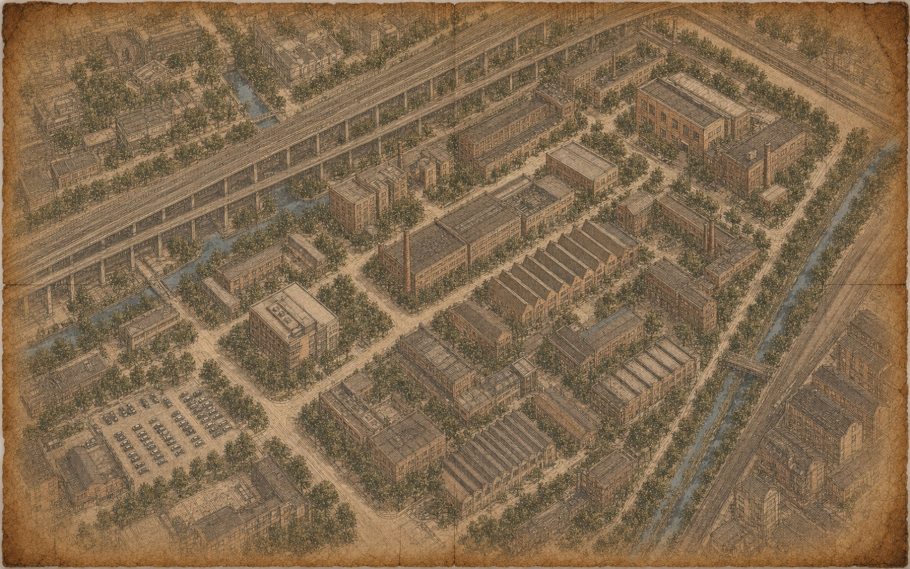
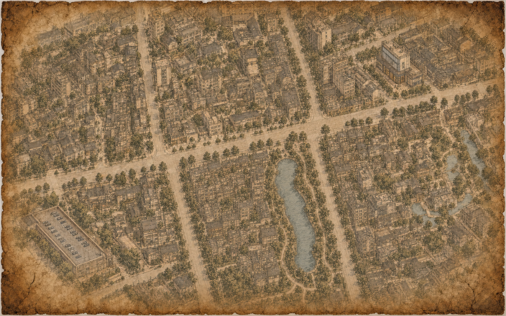
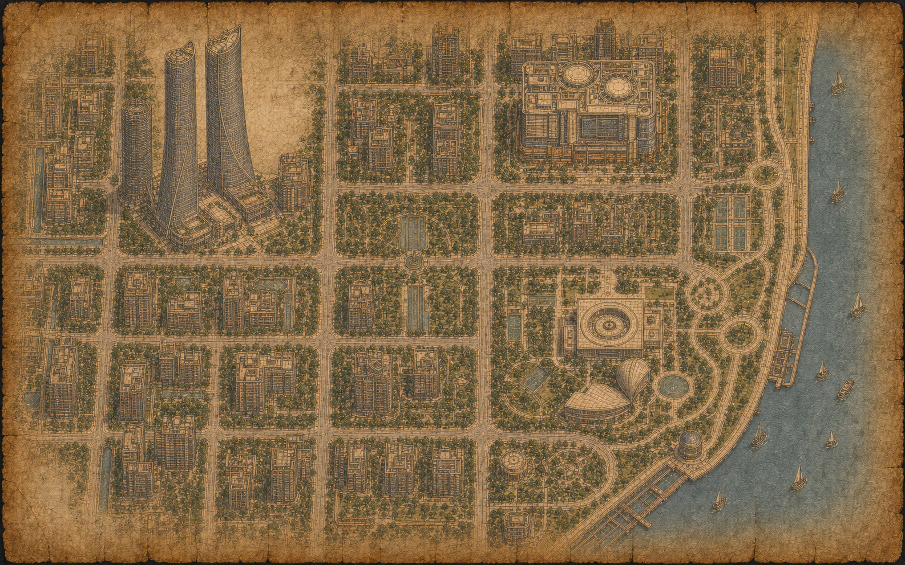

# 美术风格、示例图片与素材制作

## 1. 默认视觉方向

Exploration Atlas 的默认方向不是通用“魔法学院 UI”，而是一套更具体的视觉语言：

- 深色旧木桌与大面积羊皮纸。
- 黄铜航海仪器、星象线、墨迹、蜡封和手工装订痕迹。
- 暗金、棕黑、米黄和少量酒红。
- 古典中文衬线正文、英文展示衬线和铭文式小标题。
- 地图道路保持可读，魔法元素只作为叙事层，不改变真实空间关系。
- 动效围绕“显影、发现、解封、翻页”，不做无意义的持续炫光。

参考地图：







这些图片可以作为结构和质感参考。为自己的项目生成地图时，必须替换道路、建筑、地标和坐标，不能只改标题。

## 2. 默认由 AI 直接沿用这套风格

用户没有提出新主题时，不需要再次询问色板、字体、世界观或地图朝向。AI 直接沿用本页的羊皮纸、黄铜、星象线、墨迹、蜡封和正北朝上地图风格，并根据地点与礼物自动生成对应章节素材。

AI 仍需自行保证：

- 真实道路、水域、建筑和入口关系正确。
- 地图数量与连续步行/转场方案一致。
- 不模仿品牌、受保护 IP 或在世艺术家的独特风格。
- 用户主动指定新主题时，才询问必要的风格差异。

## 3. 地图底图制作规范

推荐尺寸：1586×992；也可以使用相同比例的更高分辨率版本。

每张地图都要提供：

- 北、南、东、西的 WGS-84 边界。
- 停车/步行起点。
- 所有关卡目标。
- 真实路线折点。
- 不可穿越的水域、围墙和封闭建筑。
- 需要辨认的道路或地标。

### 地图生成提示词模板

```text
制作一张横向生日探索地图底图，尺寸 1586×992，固定正北朝上。
真实范围：[北/南/东/西 WGS-84 边界]。
必须准确保留：[道路、水域、建筑、入口、广场列表]。
起点位于：[描述]；目标依次位于：[描述]；建议步行路线为：[描述]。

视觉风格：[风格关键词]。使用旧羊皮纸、铜版蚀刻线、低饱和墨色、暗金细节和
轻微手绘透视；道路和目标的相对方位不可因装饰改变。不要添加人物、文字、商标、
GOAL 标记或路线动画，这些由网页叠加。四周保留装饰空间，中部路线区域清晰可读。
```

不要只依赖生成模型理解真实地图。最佳流程是：先基于可靠地理数据画出准确结构，再进行风格化，最后把真实坐标投影回底图验证。

## 4. 章节美术

仓库提供六类通用章节资产：声音、移动、气味、闪耀、味道与爱。


完整生成提示词保存在 [章节美术源文件说明](../design/generated-source/chapters/README.md)。这些提示词可用于学习“主体、材质、轮廓、留白、透明背景”的描述方式；定制时应根据自己的礼物重新设计象征物。

章节资产要求：

- 单一清晰主体，缩小后仍可识别。
- 四周保留充足透明留白。
- 不出现文字、品牌 Logo 和可识别商品复刻。
- 光效包含在主体附近，不污染整个透明背景。
- 颜色与地图底图有足够对比，但不抢过路线和按钮。

## 5. 参考照片

公开模板中的 `public/references/*.svg` 是无真人示意图。正式项目应在真实触发站位拍摄参考照。

拍摄要求：

- 使用体验当天相近的镜头、方向和时间段。
- 背景包含稳定的建筑边缘、门框、树木或灯光结构。
- `pose-scene` 模式中，人物四肢和躯干尽量完整可见。
- `scene-only` 模式中，优先保证建筑与场景结构清晰。
- 不拍入无关人员正脸、车牌、家庭门牌、手机通知或聊天内容。
- 发布前移除不必要的拍摄设备、时间和定位元数据。

正式参考照可以只存在于私有部署或本地分支；公开仓库继续使用 SVG 示例，不影响代码结构。

## 6. 可选片头视频

片头完全可选。没有片头时，网页直接显示信封，这是模板默认状态。

如果生成片头，推荐结构：

1. 2–4 秒：建立世界与光线。
2. 4–8 秒：信使或其他叙事物携带信封进入。
3. 8–12 秒：信封落到桌面，镜头转为稳定俯拍。
4. 最后 0.4–1 秒：画面稳定对齐网页信封，不再出现运动或文字。

通用提示词：

```text
制作一段横向电影式生日探索片头。环境为深色旧木桌、羊皮纸、黄铜航海仪器和
温暖烛光；一个原创信使把一封带暗红蜡封的信送到画面中央。镜头运动克制、真实，
纸张和翅膀遵循物理惯性。最后逐渐切成稳定俯拍，并精确停在给定的无文字信封终帧。
不要出现姓名、年龄、Logo、水印或可识别 IP。最后一秒保持静止，方便网页无缝接管。
```

仓库保留一张无文字衔接参考图：


生成完成后，把自有媒体放入 `public/custom/`，再在 `src/config/experience.ts` 启用。视频加载失败时页面允许直接跳到信封；主流程不得依赖视频成功。

## 7. 可选背景音乐

背景音乐同样默认关闭。开启时：

- 只使用有明确许可的音乐。
- 由用户点击信封或播放按钮后开始，遵守 Safari 自动播放限制。
- 准备可循环版本，避免明显断点。
- 保留始终可见的静音按钮。
- 断网测试确认文件已经进入 PWA 缓存。

## 8. 素材交付清单

- [ ] 每张地图底图及其边界/锚点记录。
- [ ] 每关参考图及出镜授权。
- [ ] 开场、关卡、转场、终章文案。
- [ ] 章节插画或通用章节资产选择。
- [ ] PWA 图标。
- [ ] 可选片头、首尾帧和背景音乐。
- [ ] 所有素材的来源和使用许可。
- [ ] 公开版与私有版素材清单分开保存。
